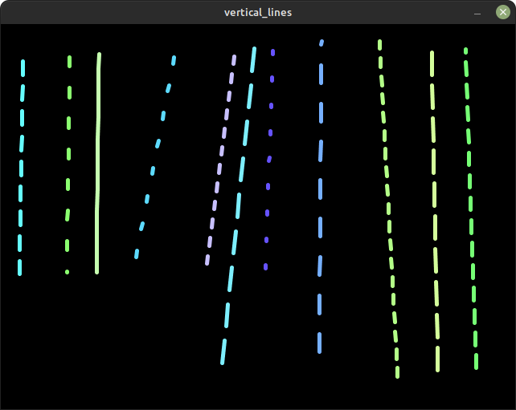

# m_onz_mapper

m-onz personal projection mapping software that will eventually be a free and open source version of [MadMapper](https://madmapper.com/). MadMapper is a powerful commercial tool but having a free open source tool that you can easily make code changes and run on low cost raspberry pi computers is useful. 

Projection mapping involves using a projector to map light onto physical objects. These objects could be screens that are not directly facing the projector head on, lines or more complex shapes. Mapping lines is pretty easy so they have been implemented first with a couple of basic patterns.

## status

Currently in a useful state for an upcoming projection mapping installation. This installation will be installed for the first two [fakedac~ events](https://fakedac.net/) that I am running. I will be suspending 22 1.2 metre strips of wood vertically, painted white from a goal post frame and using a 3700 Lumen projector and raspberry pi to run this software.

## processing compatibility

tested on processing 3.5 (might not work in processing 4 due to library dependencies).

## current features

* map straight lines
* two patterns automatically cycle (flashing and colorful strips).

## usage

* edit initLines.js with the number of lines you want
* edit initLines with the screen size width in pixels
* run node initLines.js to generate random lines
* open the app
* press 'e' to toggle the control panel
* toggle configuration mode
* move the lines until they line up with the projected target lines

## patterns

the lines will be flashing white or colorful striped patterns. More patterns to follow and configuration options to control them.

## screenshot

## todo

* allow adding and removing lines from the control panel
* integrate [keystone](https://fh-potsdam.github.io/doing-projection-mapping/processing-keystone/) to allow mapping quads.
